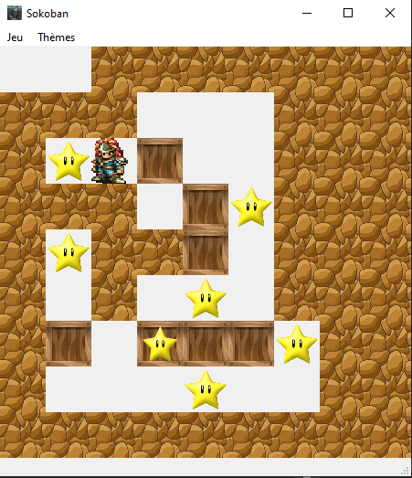
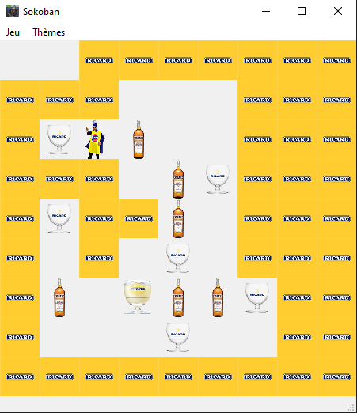
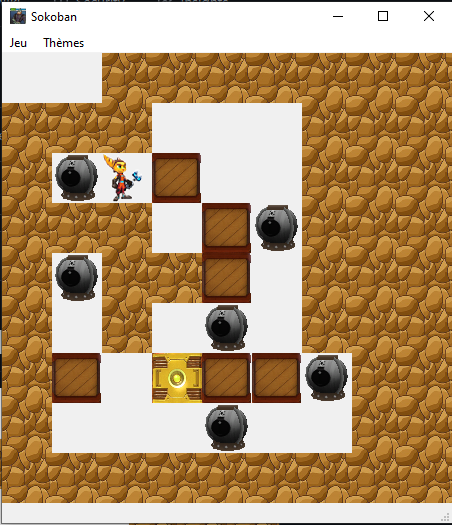
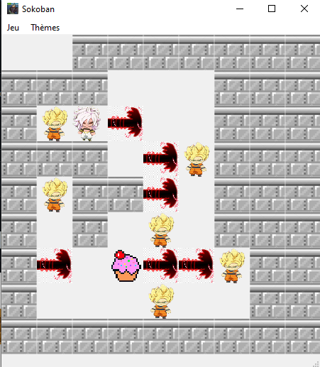

# Projet Sokoban IHM 



## Les membres de l'équipe

Ce groupe de projet est constituer de 4 personnes:

- Jonathan Caudron
- Maxence Dubois
- Corentin Gaspard
- Thibaut Gronier

## Comment lancer le jeux
Pour lancer le jeu, Il suffit d'avoir la librairie PyQt5 d'installer sur votre python :
- Pour le lancer depuis votre IDE, il suffit de lancer le fichier s'appellant main.py

- Pour le lancer depuis le Terminal , il suffit de taper cette commande quand votre terminal se trouve dans le dossier où se situe le main.py

```cmd
python3 main.py
```

ou 

```cmd
python main.py
```

## Les commandes 
### Les commandes de déplacement
Les commande pour déplacer le personnage sont les flèches directionnelles :
- Fleche du haut pour allez vers le haut
- Fleche du bas pour allez vers le bas
- Fleche de gauche pour allez vers la gauche
- Fleche de droite pour allez vers la droite

### Les Raccourcis Claviers
Les differents racourcis claviers que nous avons intégrer sont :
- Ctrl + Q : vous permettra de fermer la fenêtre du jeu plus facilement
- Crtl + R : vous permettra de relancer une partie du jeu plus facilement

## Les Differents Thèmes
### Le thème de base

Ce thème a été développer par tous les membres de l'équipe


### Le thème Ricard

Ce thème a été developper par Thibaut Gronier



### Le thème Ratchet et Clank

Ce thème a été developper par Corentin Gaspard



### Le thème Dragon Ball Z

Ce thème a été developper par Maxence Dubois



